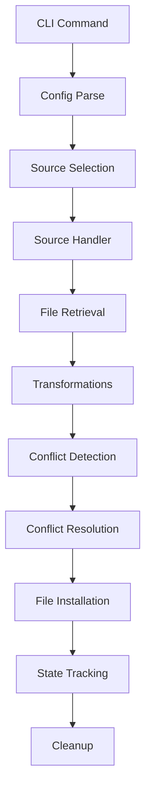

# Architecture Documentation

Technical overview of Agent Manager's internal architecture and design decisions.

## Overview

Agent Manager follows a modular Go architecture with clear separation of concerns:

```text
cmd/agent-manager/     # CLI interface using cobra
internal/
├── config/           # YAML configuration parsing with variable substitution
├── installer/        # Core installation logic with source handlers
├── transformer/      # File transformation engine
├── tracker/          # Installation state management
└── conflict/         # Conflict resolution strategies
```

## Core Components

### CLI Layer (`cmd/agent-manager/`)

**Responsibility**: Command-line interface and user interaction

- Uses [Cobra](https://github.com/spf13/cobra) for CLI framework
- Handles argument parsing and validation
- Orchestrates calls to internal packages
- Manages output formatting and verbosity

**Key Files**:

- `main.go` - Entry point and command registration
- `commands/` - Individual command implementations

### Configuration (`internal/config/`)

**Responsibility**: Configuration file parsing and validation

**Key Features**:

- YAML parsing with [yaml.v3](https://gopkg.in/yaml.v3)
- Variable substitution (`${env.VAR}`, `${settings.key}`)
- Configuration validation and defaults
- Environment variable resolution

**Key Types**:

```go
type Config struct {
    Settings Settings `yaml:"settings"`
    Sources  []Source `yaml:"sources"`
}

type Source struct {
    Name     string          `yaml:"name"`
    Type     string          `yaml:"type"`
    Enabled  bool            `yaml:"enabled"`
    // ... type-specific fields
}
```

### Installer (`internal/installer/`)

**Responsibility**: Core installation logic and source management

**Architecture**:

```text
installer/
├── installer.go      # Main installer orchestration
├── source/          # Source type handlers
│   ├── github.go    # GitHub repository handler
│   ├── git.go       # Git repository handler
│   ├── local.go     # Local filesystem handler
│   └── subagents.go # Marketplace integration
└── types.go         # Common types and interfaces
```

**Source Handler Interface**:

```go
type SourceHandler interface {
    Install(ctx context.Context, source Source) error
    Update(ctx context.Context, source Source) error
    Uninstall(ctx context.Context, source Source) error
    List(ctx context.Context, source Source) ([]FileInfo, error)
}
```

### Transformer (`internal/transformer/`)

**Responsibility**: File transformation during installation

**Built-in Transformations**:

- `remove_numeric_prefix`: Strip numeric prefixes from paths
- `extract_docs`: Move documentation files to separate directory
- `custom_script`: Execute user-defined transformation scripts

**Architecture**:

```go
type Transformer interface {
    Transform(ctx context.Context, files []File, options map[string]interface{}) ([]File, error)
}

type File struct {
    Path        string
    Content     []byte
    Permissions os.FileMode
    ModTime     time.Time
}
```

### Tracker (`internal/tracker/`)

**Responsibility**: Installation state management and tracking

**Features**:

- File-level installation tracking
- Source metadata storage
- Hash-based change detection
- JSON state persistence

**State Structure**:

```json
{
  "installations": {
    "source-name": {
      "files": {
        "path/to/file.md": {
          "hash": "sha256:...",
          "installed_at": "2024-01-13T15:04:05Z",
          "source_path": "original/path.md"
        }
      },
      "metadata": {
        "last_update": "2024-01-13T15:04:05Z",
        "commit": "abc123...",
        "version": "v1.0.0"
      }
    }
  }
}
```

### Conflict Resolution (`internal/conflict/`)

**Responsibility**: Handle file conflicts during installation

**Strategies**:

1. **Backup**: Create timestamped backups before overwriting
2. **Overwrite**: Replace existing files directly
3. **Skip**: Keep existing files, don't install conflicting ones
4. **Merge**: Attempt intelligent content merging (future)

**Implementation**:

```go
type ConflictResolver interface {
    Resolve(ctx context.Context, conflict Conflict) (Resolution, error)
}

type Conflict struct {
    TargetPath   string
    ExistingFile File
    NewFile      File
    Strategy     string
}
```

## Data Flow

### Installation Flow



### Detailed Flow

1. **Command Parsing**: Cobra parses CLI arguments
2. **Configuration**: Load and validate `agents-config.yaml`
3. **Source Selection**: Filter enabled/requested sources
4. **Authentication**: Set up credentials for source access
5. **Content Retrieval**: Download/copy files from sources
6. **Transformation**: Apply configured transformations
7. **Conflict Detection**: Check for existing files
8. **Conflict Resolution**: Apply resolution strategy
9. **Installation**: Write files to target locations
10. **State Update**: Record installation in state file
11. **Cleanup**: Remove temporary files

## Key Design Patterns

### Strategy Pattern (Conflict Resolution)

Different conflict resolution strategies implement a common interface:

```go
type Strategy interface {
    HandleConflict(existing, new File) (Action, error)
}

// Implementations
type BackupStrategy struct{}
type OverwriteStrategy struct{}
type SkipStrategy struct{}
```

### Factory Pattern (Source Handlers)

Source handlers are created based on source type:

```go
func NewSourceHandler(sourceType string) (SourceHandler, error) {
    switch sourceType {
    case "github":
        return &GitHubHandler{}, nil
    case "git":
        return &GitHandler{}, nil
    case "local":
        return &LocalHandler{}, nil
    default:
        return nil, fmt.Errorf("unsupported source type: %s", sourceType)
    }
}
```

### Pipeline Pattern (Transformations)

Transformations are applied in sequence:

```go
func (t *TransformationPipeline) Apply(files []File) ([]File, error) {
    result := files
    for _, transformer := range t.transformers {
        var err error
        result, err = transformer.Transform(result)
        if err != nil {
            return nil, err
        }
    }
    return result, nil
}
```

## Concurrency Model

### Parallel Source Processing

Sources can be processed in parallel for better performance:

```go
func (i *Installer) InstallSources(sources []Source) error {
    var wg sync.WaitGroup
    errors := make(chan error, len(sources))

    for _, source := range sources {
        wg.Add(1)
        go func(s Source) {
            defer wg.Done()
            if err := i.InstallSource(s); err != nil {
                errors <- err
            }
        }(source)
    }

    wg.Wait()
    close(errors)

    // Collect errors
    for err := range errors {
        if err != nil {
            return err
        }
    }

    return nil
}
```

### Rate Limiting

Network operations include rate limiting to avoid overwhelming servers:

```go
type RateLimiter struct {
    limiter *rate.Limiter
}

func (r *RateLimiter) Allow() bool {
    return r.limiter.Allow()
}
```

## Error Handling

### Structured Errors

Agent Manager uses structured errors with context:

```go
type InstallationError struct {
    Source    string
    Operation string
    Path      string
    Cause     error
}

func (e *InstallationError) Error() string {
    return fmt.Sprintf("installation failed for source %s: %s at %s: %v",
        e.Source, e.Operation, e.Path, e.Cause)
}
```

### Error Recovery

Operations support rollback on failure:

```go
func (i *Installer) InstallWithRollback(source Source) error {
    checkpoint := i.tracker.CreateCheckpoint(source.Name)

    if err := i.install(source); err != nil {
        if rollbackErr := i.tracker.RollbackTo(checkpoint); rollbackErr != nil {
            return fmt.Errorf("install failed and rollback failed: %v (rollback: %v)",
                err, rollbackErr)
        }
        return err
    }

    return nil
}
```

## Security Considerations

### Path Validation

All file paths are validated to prevent directory traversal:

```go
func ValidatePath(path string) error {
    cleaned := filepath.Clean(path)
    if strings.Contains(cleaned, "..") {
        return fmt.Errorf("path contains directory traversal: %s", path)
    }
    return nil
}
```

### Credential Management

Credentials are loaded from environment variables or secure storage:

```go
type CredentialProvider interface {
    GetToken(key string) (string, error)
    GetSSHKey(path string) ([]byte, error)
}
```

### File Permissions

Installed files maintain appropriate permissions:

```go
func (i *Installer) writeFile(path string, content []byte, perm os.FileMode) error {
    if perm == 0 {
        perm = 0644 // Default safe permissions
    }
    return os.WriteFile(path, content, perm)
}
```

## Testing Architecture

### Unit Tests

Each component has comprehensive unit tests:

```go
func TestGitHubHandler_Install(t *testing.T) {
    handler := &GitHubHandler{
        client: &mockGitHubClient{},
    }

    source := Source{
        Name: "test",
        Type: "github",
        Repository: "owner/repo",
    }

    err := handler.Install(context.Background(), source)
    assert.NoError(t, err)
}
```

### Integration Tests

End-to-end tests validate complete workflows:

```go
func TestInstallWorkflow(t *testing.T) {
    tmpDir := t.TempDir()
    config := createTestConfig(tmpDir)

    installer := NewInstaller(config)
    err := installer.Install()

    assert.NoError(t, err)
    assertFilesInstalled(t, tmpDir, expectedFiles)
}
```

### Mock Implementations

External dependencies are mocked for testing:

```go
type MockGitHubClient struct {
    repositories map[string]*Repository
}

func (m *MockGitHubClient) GetRepository(owner, repo string) (*Repository, error) {
    key := fmt.Sprintf("%s/%s", owner, repo)
    if repo, exists := m.repositories[key]; exists {
        return repo, nil
    }
    return nil, fmt.Errorf("repository not found: %s", key)
}
```

## Performance Considerations

### Caching

Multiple levels of caching improve performance:

1. **HTTP Cache**: API responses cached locally
2. **File Cache**: Downloaded files cached by hash
3. **State Cache**: In-memory state for fast queries

### Memory Management

Large files are streamed rather than loaded entirely into memory:

```go
func (h *GitHubHandler) downloadFile(url string, dest io.Writer) error {
    resp, err := http.Get(url)
    if err != nil {
        return err
    }
    defer resp.Body.Close()

    _, err = io.Copy(dest, resp.Body)
    return err
}
```

### Batch Operations

Related operations are batched for efficiency:

```go
func (t *Tracker) UpdateFiles(files []FileUpdate) error {
    tx := t.db.Begin()
    defer tx.Rollback()

    for _, file := range files {
        if err := tx.Create(&file).Error; err != nil {
            return err
        }
    }

    return tx.Commit().Error
}
```

## Extension Points

### Custom Source Types

New source types can be added by implementing the `SourceHandler` interface:

```go
type S3Handler struct {
    client *s3.Client
}

func (h *S3Handler) Install(ctx context.Context, source Source) error {
    // S3-specific installation logic
}
```

### Custom Transformations

New transformations implement the `Transformer` interface:

```go
type MarkdownProcessor struct{}

func (p *MarkdownProcessor) Transform(files []File, options map[string]interface{}) ([]File, error) {
    // Process markdown files
}
```

### Hooks and Plugins

Future versions will support plugin architecture:

```go
type Plugin interface {
    Name() string
    Version() string
    Execute(ctx context.Context, event Event) error
}
```

## Future Architecture

### Planned Improvements

1. **Database Backend**: Replace JSON state with SQLite
2. **Plugin System**: Support for external plugins
3. **Webhook Integration**: Notify external systems of changes
4. **Distributed Mode**: Support for multi-node installations
5. **GraphQL API**: Programmatic access to Agent Manager

### Scalability

- Horizontal scaling through sharding by source
- Async processing for large installations
- Streaming for memory efficiency
- Connection pooling for database access

## See Also

- [Build Guide](BUILD.md)
- [Contributing Guide](CONTRIBUTING.md)
- [Configuration Reference](../reference/CONFIG-SCHEMA.md)
